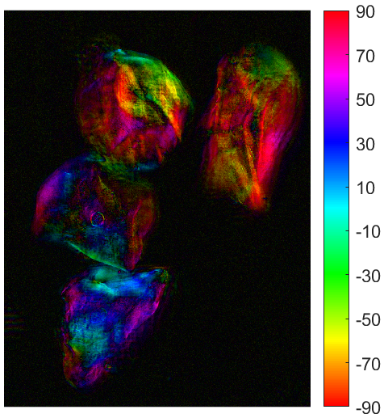
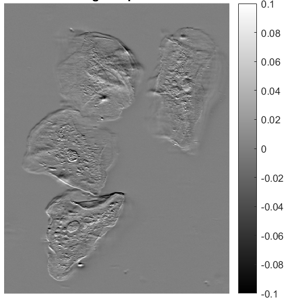

# Portfolio

### Education
- (2023 - Present) **Ph. D., Physics** | University of Brest, France
- (2022 - 2023) **M.S., Physics, Optics and Photonics** | University of Brest, France
- (2019 - 2021) **B.S., Physics** | University of Brest, France

### Research experience
- **PhD in optical microscopy at the University of Brest**\
  Development of fast and sensitive label-free microscopy multimodal techniques using polarization of light and its applications to biomedical imaging.
- **Master's thesis at the University of Brest**\
  Sensitive widefield polarized light microscopy

### Publications and patents
- **H. Laviec**, S. Rivet, M. Dubreuil, G. Gilbert and Y. Le Grand, "Multimodal polarization and phase microscopy by spectrally structured asymmetric illumination", *to be submitted* to Biomedial Optics Express, 2026
- **H. Laviec**, S. Rivet, M. Dubreuil and Y. Le Grand, ["Video rate widefield sensitive polarized light microscopy by spectrally structured illumination"](https://www.researchgate.net/publication/395208448_Video_rate_widefield_sensitive_polarized_light_microscopy_by_spectrally_structured_illumination?_tp=eyJjb250ZXh0Ijp7InBhZ2UiOiJwcm9maWxlIiwicHJldmlvdXNQYWdlIjoiaG9tZSIsInBvc2l0aW9uIjoicGFnZUNvbnRlbnQifX0), Optics Letters, 2025
- **H. Laviec**, S. Rivet, M. Dubreuil and Y. Le Grand, ["Widefield sensitive birefringence microscopy by spectral encoding of the polarization"](https://www.researchgate.net/publication/383481052_Widefield_quantitative_polarized_light_microscopy_using_spectrally_encoded_null_polarimetry), Optics Letters, 2024
- S. Rivet, M. Dubreuil, Y. Le Grand, B. Boulbry and **H. Laviec**, "Dispositif de démodulation par éclairement spectralement structuré pour la microscopie plein champ de la biréfringence par codage spectral", Patent FR2406902, 2024

### Conference presentation
- *(submitted)* French congress of Optics, Dijon, July 2026
- *(accepted)* SPIE Europe 2026, oral presentation, Strasbourg, April 2026
- Conference of IBSAM (Institut Brestois Santé Agro Matière), poster, Brest, 2025
- French congress of Optics, [oral presentation](https://www.researchgate.net/publication/392936746_MICROSCOPIE_DE_BIREFRINGENCE_A_BALAYAGE_LASER_ET_PLEIN_CHAMP_PAR_CODAGE_SPECTRAL_DE_LA_POLARISATION?_tp=eyJjb250ZXh0Ijp7InBhZ2UiOiJwcm9maWxlIiwicHJldmlvdXNQYWdlIjpudWxsLCJwb3NpdGlvbiI6InBhZ2VDb250ZW50In19), Rouen, 2025

### Results
<figure>
  

    
    
  

  <figcaption>
    This figure shows (a) the birefringence of human cheek cells and its orienttion and (b) the phase gradient of the cells
  </figcaption>
</figure>

